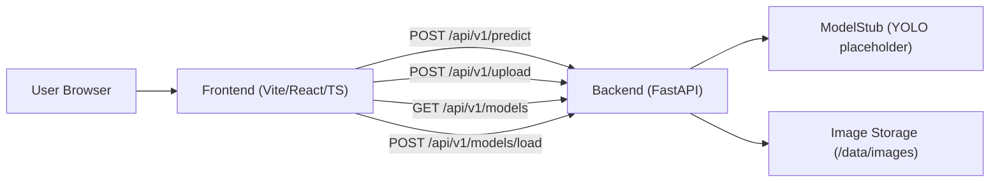

## Surface Defect Detection System

Full-stack mock system for surface defect detection with a FastAPI backend and a React + TypeScript + Vite + Tailwind frontend.

---

## Architecture



### Backend

- FastAPI application (`backend/app/main.py`)
- Endpoints:
  - `POST /api/v1/predict` – image inference via `ModelStub`
  - `POST /api/v1/upload` – dataset image upload to `./data/images`
  - `GET /api/v1/models` – list mock models
  - `POST /api/v1/models/load` – toggle mock model loaded state
  - `GET /api/v1/health` – health check
- Deterministic detection stub in `backend/app/core/model_stub.py`
- Pytest-based tests in `backend/app/tests`

### Frontend

- React + TypeScript + Vite (`frontend/`)
- Tailwind CSS dark theme
- Main pages:
  - Dashboard
  - Inference (integrated with `/api/v1/predict`, Konva overlays)
  - Dataset (integrated with `/api/v1/upload`)
  - Models (integrated with `/api/v1/models` + `/api/v1/models/load`)
  - Logs
  - Settings

---

## Running locally (no Docker)

### Prerequisites

- Python 3.10+
- Node.js 20+ and npm

### Backend

```bash
cd backend
python -m venv .venv
.venv\Scripts\activate      # Windows
# source .venv/bin/activate # Linux/macOS

pip install -r requirements.txt
uvicorn app.main:app --reload --host 0.0.0.0 --port 8000
```

Verify:

- `http://localhost:8000/api/v1/health`
- `http://localhost:8000/docs`

### Frontend

```bash
cd frontend
npm install
npm run dev
```

Open: `http://localhost:5173`

The frontend assumes the backend is available at `http://localhost:8000`.

---

## Running with docker-compose

### Prerequisites

- Docker Engine / Docker Desktop

### Steps

From the project root:

```bash
docker compose up --build
```

This will start:

- Backend at `http://localhost:8000`
- Frontend at `http://localhost:5173`

To stop:

```bash
docker compose down
```

Uploaded images are stored on the host under `./data` (mounted into the backend container as `/data`).

---

## Replacing `ModelStub` with a real YOLO model

The current system uses a deterministic stub in `backend/app/core/model_stub.py`:

- `ModelStub.predict(image: PIL.Image.Image) -> List[Detection]`
- Always returns a single `"scratch"` detection with fixed confidence and a bbox derived from image size.

To replace this with a real YOLO model:

1. **Add YOLO dependencies**
   - Update `backend/requirements.txt` with the required library, for example:
     - `ultralytics` or your preferred YOLO implementation.
   - Rebuild the backend environment or Docker image.

2. **Add model weights to `/backend/models`**
   - Create a `backend/models/` directory.
   - Place your YOLO weights there, e.g.:
     - `backend/models/surface-yolo-v1.pt`
     - `backend/models/surface-yolo-v2.pt`
   - Make sure `.gitignore` is configured so that large model files are *not* committed if that is desired.

3. **Load the model in `ModelStub`**
   - Replace `ModelStub` with a real implementation, for example:
     - Load the model once at initialization using a weights path.
     - Keep the `predict(image)` method signature the same and return a list of `Detection` objects.
   - The method should:
     - Accept a `PIL.Image.Image`
     - Run YOLO inference
     - Map YOLO outputs (class, confidence, bbox) into the existing response schema:
       - `class` (string)
       - `confidence` (0–1 float)
       - `bbox` as `[x, y, w, h]` in image coordinates.

4. **Maintain API compatibility**
   - Do not change the shape of the JSON returned by `/api/v1/predict`.
   - The frontend Inference page expects:
     - `detections: [{ class, confidence, bbox }]`
     - `meta: { width, height, inference_ms }`

---

## CI (GitHub Actions)

CI configuration lives in `.github/workflows/ci.yml` and will:

- Install backend dependencies and run pytest:
  - `pip install -r backend/requirements.txt`
  - `pytest -q` (from `backend/`)
- Install frontend dependencies and run lint/build:
  - `npm ci` or `npm install` (from `frontend/`)
  - `npm run lint`
  - `npm run build`

This workflow runs on pushes and pull requests targeting `main`/`master`.

---

## TODO: Training pipeline

Planned future work:

- **Data ingestion**
  - Define dataset manifests (splits, labels, metadata).
  - Add dataset versioning and integrity checks.
- **Training pipeline**
  - CLI or API to kick off YOLO training runs using images from `./data/images`.
  - Configuration for hyperparameters, augmentation, and evaluation.
- **Model registry**
  - Store trained weights under `backend/models` with metadata.
  - Extend `/api/v1/models` to surface metrics (mAP, last trained, etc.).
- **Scheduled retraining**
  - Optional cron/job integration to retrain on new data.
